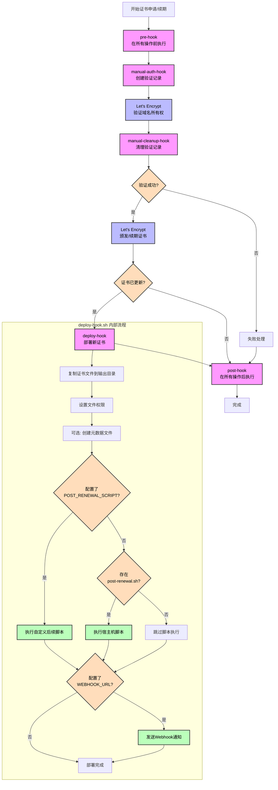

# X Certbot - 开发指南

本文档提供 X Certbot 系统的开发指南，包括项目结构、代码规范、扩展方法和贡献指南。

## 1. 项目结构

```
x.certbot/
├── .github/                   # GitHub 工作流配置
│   └── workflows/             # GitHub Actions 工作流定义
│       └── docker-publish.yml # Docker 镜像发布工作流
├── scripts/                   # 脚本文件
│   └── deploy-hook.sh         # 证书部署脚本
├── plugins/                   # 插件目录
│   ├── dns/                   # DNS 验证插件
│   │   ├── aliyun.sh          # 阿里云 DNS 验证脚本
│   │   └── tencentcloud.sh    # 腾讯云 DNS 验证脚本
│   └── http/                  # HTTP 验证插件
│       ├── aliyun.sh          # 阿里云 HTTP 验证脚本
│       ├── tencentcloud.sh    # 腾讯云 HTTP 验证脚本
│       └── common.sh          # 通用 HTTP 验证脚本
├── docs/                      # 文档文件
│   ├── 01-system-architecture.md    # 系统架构
│   ├── 02-technical-specifications.md  # 技术规范
│   ├── 03-component-implementation.md  # 组件实现
│   ├── 04-usage-guide.md      # 使用指南
│   ├── 05-development-guide.md  # 开发指南（本文档）
│   ├── .env.example           # 环境变量示例文件
│   ├── certbot-renew-example.yml # GitHub Actions 工作流示例
│   └── README.md              # 文档目录说明
├── .gitignore                 # Git 忽略文件
├── Dockerfile                 # Docker 构建文件
├── entrypoint.sh              # 容器入口脚本
├── install.sh                 # 无 Docker 环境安装脚本
├── LICENSE                    # 许可证文件
└── README.md                  # 项目说明文件
```

## 2. 开发环境设置

### 2.1 开发环境要求

- Git
- Docker & Docker Compose
- Bash 或兼容的 Shell
- 用于测试的阿里云账号
- 文本编辑器或 IDE

### 2.2 开发环境设置步骤

#### Docker 环境开发

1. 克隆仓库：
```bash
git clone https://github.com/aispin/x.certbot.git
cd x.certbot
```

2. 创建 .env 文件：
```bash
cp docs/.env.example .env
# 编辑 .env 文件，填入您的测试凭据
```

3. 构建开发用 Docker 镜像：
```bash
docker build -t x.certbot:dev .
```

4. 运行开发容器：
```bash
docker run -it --rm \
  -v $(pwd):/app \
  -v $(pwd)/.env:/.env \
  --name x.certbot-dev \
  x.certbot:dev /bin/bash
```

#### 非 Docker 环境开发

如果您需要在非 Docker 环境中开发和测试 `install.sh` 脚本：

1. 克隆仓库：
```bash
git clone https://github.com/aispin/x.certbot.git
cd x.certbot
```

2. 为 `install.sh` 添加执行权限：
```bash
chmod +x install.sh
```

3. 在测试环境中运行安装脚本（请谨慎操作，最好在虚拟机或测试服务器上进行）：
```bash
# 查看帮助信息
./install.sh --help

# 使用测试参数运行
sudo ./install.sh --dir /tmp/xcertbot-test
```

4. 测试完成后清理测试环境：
```bash
sudo rm -rf /tmp/xcertbot-test
```

### 2.3 开发 install.sh 脚本

`install.sh` 脚本用于在无 Docker 环境的服务器上直接安装 X Certbot。开发此脚本时，请注意以下几点：

1. **参数处理**：
   - 确保正确处理命令行参数
   - 提供清晰的帮助信息
   - 支持自定义安装选项

2. **错误处理**：
   - 检查必要的权限和依赖
   - 提供有意义的错误消息
   - 在失败时进行适当的清理

3. **兼容性**：
   - 确保脚本在不同的 Linux 发行版上工作
   - 测试在 Debian/Ubuntu、CentOS/RHEL 和 Alpine 上的兼容性

4. **测试方法**：
   - 使用 `--dir` 参数指定测试目录
   - 在虚拟机或容器中进行测试
   - 验证安装后的功能

## 3. 代码规范

### 3.1 Bash 脚本规范

1. **文件头**：
   - 所有脚本以 `#!/bin/bash` 开头
   - 添加简短描述说明脚本功能

2. **注释规范**：
   - 使用 `#` 添加注释
   - 重要函数前添加详细注释
   - 复杂逻辑添加内联注释

3. **命名规范**：
   - 变量使用大写（环境变量或全局变量）
   - 函数使用小写加下划线
   - 临时变量使用小写

4. **函数规范**：
   - 函数定义前加注释
   - 函数应有明确的输入和输出
   - 使用 `local` 关键字定义局部变量

5. **错误处理**：
   - 关键命令检查返回状态
   - 使用有意义的错误消息
   - 关键错误应有适当的退出码

### 3.2 Dockerfile 规范

1. **基础镜像**：
   - 使用特定版本标签，避免 `latest`
   - 优先使用轻量级镜像如 Alpine

2. **指令顺序**：
   - 按变更频率排序指令，最少变更的放前面
   - 合并 RUN 指令减少层数

3. **环境变量**：
   - 使用 ENV 定义默认环境变量
   - 在文档中说明所有环境变量

## 4. 扩展指南

### 4.1 添加新功能

要向项目添加新功能，请按照以下步骤操作：

1. **创建功能分支**：
```bash
git checkout -b feature/your-feature-name
```

2. **实现功能**：
   - 修改或添加必要的脚本
   - 更新 Dockerfile（如需要）
   - 添加或更新测试用例

3. **记录变更**：
   - 更新相关文档
   - 在 README.md 中添加新功能说明

4. **提交变更**：
```bash
git commit -m "feat: add your feature description"
```

### 4.2 DNS 脚本扩展

如果需要扩展或修改 DNS 验证脚本逻辑：

1. **理解现有脚本**：
   - 熟悉 `plugins/dns/aliyun.sh` 的工作原理
   - 了解 Certbot 的钩子机制和 DNS-01 验证流程

2. **修改脚本**：
   - 保持命令行接口兼容性（支持 `clean` 参数）
   - 确保脚本能够正确处理 `CERTBOT_DOMAIN` 和 `CERTBOT_VALIDATION` 环境变量
   - 添加适当的错误处理和日志记录

3. **测试变更**：
   - 使用实际域名测试 DNS 记录添加
   - 验证记录可以正确删除
   - 测试边缘情况和错误条件

### 4.3 支持其他 DNS 提供商

要支持其他 DNS 提供商，请按照以下步骤操作：

1. **创建新的 DNS 脚本**：
   - 在 `plugins/dns/` 目录下创建新的脚本文件，例如 `cloudflare.sh`
   - 遵循现有脚本的接口约定
   - 实现特定提供商的 API 调用逻辑

2. **脚本要求**：
   - 脚本必须支持两种操作模式：添加记录和删除记录
   - 添加记录：`./cloudflare.sh`（不带参数）
   - 删除记录：`./cloudflare.sh clean`
   - 脚本必须处理 `CERTBOT_DOMAIN` 和 `CERTBOT_VALIDATION` 环境变量

3. **实现示例**：
```bash
#!/bin/bash

# Cloudflare DNS 验证脚本
# 用于 Let's Encrypt DNS-01 验证

# 设置默认值
API_TOKEN=""
DOMAIN=""
RECORD="_acme-challenge"
VALUE=""
ACTION="add"

# 解析命令行参数
if [ "$1" == "clean" ]; then
    ACTION="delete"
    shift
fi

# 从环境变量获取域名和验证值
if [ -n "$CERTBOT_DOMAIN" ]; then
    DOMAIN="$CERTBOT_DOMAIN"
fi

if [ -n "$CERTBOT_VALIDATION" ]; then
    VALUE="$CERTBOT_VALIDATION"
fi

# 从环境变量或配置文件获取 API 令牌
if [ -n "$CLOUDFLARE_API_TOKEN" ]; then
    API_TOKEN="$CLOUDFLARE_API_TOKEN"
elif [ -f "$HOME/.cloudflare/credentials" ]; then
    API_TOKEN=$(grep "api_token" "$HOME/.cloudflare/credentials" | cut -d= -f2 | xargs)
fi

# 检查必要参数
if [ -z "$DOMAIN" ] || [ -z "$VALUE" ] || [ -z "$API_TOKEN" ]; then
    echo "错误: 缺少必要参数"
    echo "请确保设置了 CERTBOT_DOMAIN, CERTBOT_VALIDATION 和 CLOUDFLARE_API_TOKEN"
    exit 1
fi

# 提取域名信息
# 实现域名处理逻辑...

# 执行 DNS 操作
if [ "$ACTION" == "add" ]; then
    # 添加 DNS 记录
    # 实现 API 调用...
    echo "已添加 DNS 记录"
elif [ "$ACTION" == "delete" ]; then
    # 删除 DNS 记录
    # 实现 API 调用...
    echo "已删除 DNS 记录"
fi
```

4. **更新配置**：
   - 确保 `entrypoint.sh` 能够识别新的提供商
   - 添加必要的环境变量支持

5. **更新文档**：
   - 在 `docs/04-usage-guide.md` 中添加新提供商的使用说明
   - 更新 `docs/.env.example` 添加新的配置选项

### 4.4 HTTP 验证插件开发

除了 DNS 验证外，X Certbot 还支持 HTTP 验证。要开发 HTTP 验证插件：

1. **创建新的 HTTP 脚本**：
   - 在 `plugins/http/` 目录下创建新的脚本文件
   - 遵循与 DNS 插件类似的接口约定

2. **脚本要求**：
   - 脚本必须支持添加和删除验证文件
   - 脚本必须处理 `CERTBOT_DOMAIN`、`CERTBOT_VALIDATION` 和 `CERTBOT_TOKEN` 环境变量

3. **实现关键功能**：
   - 将验证文件上传到 Web 服务器
   - 确保验证文件可通过 `http://<domain>/.well-known/acme-challenge/<token>` 访问
   - 验证完成后删除验证文件

4. **更新配置**：
   - 在 `entrypoint.sh` 中添加对新 HTTP 插件的支持
   - 设置 `CHALLENGE_TYPE=http` 以启用 HTTP 验证

## 5. 测试指南

### 5.1 手动测试

1. **环境变量测试**：
   - 测试所有必需环境变量
   - 测试错误的环境变量组合

2. **DNS 操作测试**：
   - 测试 DNS 记录添加
   - 测试 DNS 记录删除
   - 测试无效域名场景

3. **证书流程测试**：
   - 测试完整的证书申请流程
   - 测试证书续期流程
   - 测试部署钩子执行

### 5.2 自动化测试

对于自动化测试，可以构建测试脚本验证各个组件：

```bash
#!/bin/bash
# 示例测试脚本

# 测试环境变量加载
test_env_loading() {
    # 创建测试 .env 文件
    echo "TEST_VAR=test_value" > test.env
    
    # 运行入口脚本的环境变量加载部分
    source ./test_env_loader.sh
    
    # 验证结果
    if [ "$TEST_VAR" != "test_value" ]; then
        echo "环境变量加载测试失败"
        return 1
    fi
    
    echo "环境变量加载测试通过"
    return 0
}

# 测试域名处理函数
test_domain_processing() {
    # 设置测试域名
    export DOMAINS="example.com,sub.example.com"
    
    # 运行域名处理函数
    source ./test_domain_processor.sh
    result=$(process_domains)
    
    # 验证结果
    expected="-d example.com -d *.example.com -d sub.example.com"
    if [ "$result" != "$expected" ]; then
        echo "域名处理测试失败"
        echo "期望: $expected"
        echo "实际: $result"
        return 1
    fi
    
    echo "域名处理测试通过"
    return 0
}

# 运行测试
test_env_loading
test_domain_processing
```

## 6. 持续集成/持续部署

项目使用 GitHub Actions 实现 CI/CD 流程。

### 6.1 GitHub Actions 工作流

项目包含以下主要工作流：

1. **Docker 镜像构建与发布** (`.github/workflows/docker-publish.yml`):
   - 在代码推送到主分支或发布标签时触发
   - 构建 Docker 镜像
   - 自动提取版本信息
   - 推送到 Docker Hub 和阿里云容器镜像服务
   - 支持多平台构建 (linux/amd64, linux/arm64)

2. **证书自动续期示例** (`docs/certbot-renew-example.yml`):
   - 提供给用户的 GitHub Actions 工作流示例
   - 用于自动获取和部署证书
   - 支持定时执行、手动触发和版本发布触发
   - 包含证书部署和服务重启功能

### 6.2 Docker 镜像发布工作流

`docker-publish.yml` 工作流的主要功能：

```yaml
name: Docker Image CI

on:
  push:
    branches: [ "main" ]
    tags: [ 'v*.*.*' ]
  pull_request:
    branches: [ "main" ]

jobs:
  build:
    runs-on: ubuntu-latest
    steps:
      - name: Checkout code
        uses: actions/checkout@v4
        with:
          fetch-depth: 0
          
      - name: Extract version
        id: version
        run: |
          # 提取版本信息逻辑...
          
      - name: Set up Docker Buildx
        uses: docker/setup-buildx-action@v3
        
      - name: Login to Docker Hub
        uses: docker/login-action@v3
        with:
          username: ${{ vars.DOCKERHUB_USERNAME }}
          password: ${{ secrets.DOCKERHUB_TOKEN }}
          
      - name: Build and push
        uses: docker/build-push-action@v5
        with:
          context: .
          platforms: linux/amd64,linux/arm64
          push: true
          tags: ${{ steps.version.outputs.tags }}
          build-args: |
            VERSION=${{ steps.version.outputs.version }}
```

### 6.3 证书自动续期工作流

`certbot-renew-example.yml` 工作流的主要功能：

```yaml
name: Certbot Certificate Renewal

on:
  schedule:
    - cron: '0 0 * * 1,4'  # 每周一和周四凌晨执行
  workflow_dispatch:  # 允许手动触发
  push:
    tags:
      - 'v*.*.*'  # 发布新版本时触发

jobs:
  renew-certificates:
    runs-on: ubuntu-latest
    steps:
      - name: Checkout code
        uses: actions/checkout@v4
        
      - name: Set up Docker
        uses: docker/setup-buildx-action@v3
        
      - name: Run Certbot container
        run: |
          # 运行 X Certbot 容器获取证书...
          
      - name: Deploy certificates to server
        uses: appleboy/scp-action@v0.1.7
        with:
          host: ${{ secrets.SERVER_HOST }}
          username: ${{ secrets.SERVER_USERNAME }}
          key: ${{ secrets.SERVER_SSH_KEY }}
          source: "./certs/*"
          target: ${{ secrets.CERT_DESTINATION_PATH }}
          
      - name: Restart services
        uses: appleboy/ssh-action@v1.2.1
        with:
          host: ${{ secrets.SERVER_HOST }}
          username: ${{ secrets.SERVER_USERNAME }}
          key: ${{ secrets.SERVER_SSH_KEY }}
          script: |
            # 重启服务...
```

### 6.4 配置 CI/CD

要配置 CI/CD 环境，需要设置以下 GitHub Secrets 和 Variables：

#### Docker 镜像发布所需配置

| 名称 | 类型 | 说明 |
|------|------|------|
| DOCKERHUB_USERNAME | Variable | Docker Hub 用户名 |
| DOCKERHUB_TOKEN | Secret | Docker Hub 访问令牌 |
| ALIYUN_CR_USERNAME | Secret | 阿里云容器镜像服务用户名 |
| ALIYUN_CR_PASSWORD | Secret | 阿里云容器镜像服务密码 |
| ALIYUN_CR_URL | Secret | 阿里云容器镜像服务注册地址 |
| ALIYUN_CR_NAMESPACE | Variable | 阿里云容器镜像服务命名空间 |

#### 证书自动续期所需配置

| 名称 | 类型 | 说明 |
|------|------|------|
| ALIYUN_REGION | Secret | 阿里云区域 |
| ALIYUN_ACCESS_KEY_ID | Secret | 阿里云访问密钥 ID |
| ALIYUN_ACCESS_KEY_SECRET | Secret | 阿里云访问密钥 Secret |
| DOMAINS | Secret | 域名列表，逗号分隔 |
| EMAIL | Secret | 证书所有者的电子邮件地址 |
| SERVER_HOST | Secret | 目标服务器 IP 或域名 |
| SERVER_USERNAME | Secret | SSH 用户名 |
| SERVER_SSH_KEY | Secret | SSH 私钥 |
| CERT_DESTINATION_PATH | Secret | 证书目标路径 |
| RESTART_COMMAND | Secret | 证书部署后运行的命令（可选） |
| WEBHOOK_URL | Secret | 用于通知的 Webhook URL（可选） |

## 7. 发布流程

### 7.1 版本规范

项目使用语义化版本控制 (SemVer)：

- **主版本号**：不兼容的 API 变更
- **次版本号**：向后兼容的功能性新增
- **修订号**：向后兼容的问题修正

### 7.2 发布步骤

1. **更新版本号**:
   - 在相关文件中更新版本号
   - 提交更新： `git commit -m "build: bump version to x.y.z"`

2. **创建发布标签**:
```bash
git tag -a vx.y.z -m "Release version x.y.z"
git push origin vx.y.z
```

3. **创建 GitHub Release**:
   - 访问 GitHub 仓库的 Releases 页面
   - 创建新的 Release，选择刚推送的标签
   - 添加详细的发布说明

4. **监控自动构建**:
   - 确保 GitHub Actions 自动构建成功
   - 验证新镜像已推送到 Docker Hub 和阿里云容器镜像服务

## 8. 贡献指南

### 8.1 贡献流程

1. Fork 项目仓库
2. 创建功能分支： `git checkout -b feature/amazing-feature`
3. 提交更改： `git commit -m 'feat: add some amazing feature'`
4. 推送分支： `git push origin feature/amazing-feature`
5. 提交 Pull Request

### 8.2 提交信息规范

使用 Conventional Commits 规范：

- `feat`: 新功能
- `fix`: 修复 bug
- `docs`: 文档更新
- `style`: 代码风格调整
- `refactor`: 重构代码
- `perf`: 性能优化
- `test`: 添加或修改测试
- `build`: 构建系统或依赖相关
- `ci`: CI 配置和脚本

示例：

```
feat: 添加对多区域部署的支持

- 实现了阿里云多区域 DNS 记录添加
- 更新了文档说明多区域配置方法
- 添加了相关测试用例
```

### 8.3 代码审查指南

贡献者应遵循以下代码审查准则：

1. 确保代码满足代码规范
2. 确保添加了适当的测试
3. 确保更新了相关文档
4. 确保所有测试通过
5. 请求多人审查重要变更 

## 8. 钩子脚本与自动化流程

X Certbot 利用 Certbot 的钩子系统实现自动化的证书申请、验证和部署流程。了解这些钩子的执行顺序和作用对于开发和调试非常重要。

### 8.1 钩子执行流程

以下流程图展示了 Certbot 钩子的执行顺序以及 X Certbot 中的自定义脚本调用关系：



### 8.2 钩子说明

| 钩子名称 | 执行时机 | 主要作用 | 环境变量 |
|---------|---------|---------|---------|
| **pre-hook** | 所有操作前 | 准备环境，如停止 Web 服务器 | - |
| **manual-auth-hook** | 验证前 | 创建域名验证记录（DNS 或 HTTP） | CERTBOT_DOMAIN, CERTBOT_VALIDATION, CERTBOT_TOKEN |
| **manual-cleanup-hook** | 验证后 | 清理验证记录 | CERTBOT_DOMAIN, CERTBOT_VALIDATION, CERTBOT_TOKEN |
| **deploy-hook** | 证书更新后 | 部署新证书，重启服务 | RENEWED_LINEAGE, RENEWED_DOMAINS |
| **post-hook** | 所有操作后 | 恢复环境，如启动 Web 服务器 | - |

### 8.3 X Certbot 自定义脚本

#### 8.3.1 DNS 验证脚本 (manual-auth-hook)

X Certbot 使用 `plugins/dns/{provider}.sh` 作为 DNS 验证的 manual-auth-hook。这些脚本负责：

- 接收 `CERTBOT_DOMAIN` 和 `CERTBOT_VALIDATION` 环境变量
- 创建 `_acme-challenge` TXT 记录
- 返回成功状态码

当脚本带 `clean` 参数执行时，作为 manual-cleanup-hook 使用，负责清理验证记录。

#### 8.3.2 部署脚本 (deploy-hook)

X Certbot 使用 `scripts/deploy-hook.sh` 作为 deploy-hook。这个脚本负责：

- 复制证书文件到指定输出目录
- 设置适当的文件权限
- 可选地创建元数据文件
- 执行自定义后续脚本
- 发送 webhook 通知

### 8.4 自定义后续脚本

#### 8.4.1 POST_RENEWAL_SCRIPT

- **作用**：在证书更新后执行自定义脚本，通常用于重启服务或分发证书
- **调用时机**：在 deploy-hook 内部，证书文件复制完成后
- **传递变量**：
  ```
  RENEWED_DOMAIN - 主域名
  RENEWED_FULLCHAIN - 完整证书链路径
  RENEWED_PRIVKEY - 私钥路径
  RENEWED_CERT - 证书路径
  RENEWED_CHAIN - 证书链路径
  ```
- **优先级**：如果设置了 POST_RENEWAL_SCRIPT，优先使用；否则尝试使用 /host-scripts/post-renewal.sh

##### 技术实现详解

`POST_RENEWAL_SCRIPT` 的执行逻辑在 `scripts/deploy-hook.sh` 中实现。执行流程如下：

1. 检查 `POST_RENEWAL_SCRIPT` 环境变量是否设置
2. 验证指定的脚本文件是否存在且可执行
3. 设置必要的环境变量并执行脚本
4. 如果 `POST_RENEWAL_SCRIPT` 未设置或无效，则尝试执行默认位置的脚本 `/host-scripts/post-renewal.sh`

**执行条件**：
```bash
if [ -n "$POST_RENEWAL_SCRIPT" ] && [ -f "$POST_RENEWAL_SCRIPT" ] && [ -x "$POST_RENEWAL_SCRIPT" ]; then
    # 执行自定义脚本
elif [ -f "/host-scripts/post-renewal.sh" ] && [ -x "/host-scripts/post-renewal.sh" ]; then
    # 执行默认位置脚本
fi
```

**脚本执行环境**：

脚本在容器内执行，但可以通过以下方式与外部环境交互：

1. **SSH 连接**：脚本可以使用 SSH 连接到其他服务器执行命令
2. **API 调用**：脚本可以调用外部 API 触发操作
3. **共享卷**：脚本可以操作挂载到容器的宿主机目录

**错误处理**：

脚本的退出状态会被记录，但不会影响 Certbot 的整体执行流程。即使脚本执行失败，Certbot 也会认为证书更新成功。

##### 开发自定义脚本

开发自定义后续脚本时，请遵循以下指南：

1. **脚本头部**：
   ```bash
   #!/bin/bash
   set -e  # 遇到错误立即退出
   
   # 记录开始执行
   echo "开始执行后续脚本: $(date)"
   ```

2. **使用环境变量**：
   ```bash
   echo "处理域名: $RENEWED_DOMAIN"
   echo "证书路径: $RENEWED_FULLCHAIN"
   echo "私钥路径: $RENEWED_PRIVKEY"
   ```

3. **错误处理**：
   ```bash
   if ! command_that_might_fail; then
     echo "错误: 命令执行失败"
     # 可以选择继续执行或退出
     exit 1
   fi
   ```

4. **日志记录**：
   ```bash
   log_file="/var/log/cert-renewal.log"
   echo "[$(date)] 证书 $RENEWED_DOMAIN 已更新" >> $log_file
   ```

5. **执行外部命令示例**：
   ```bash
   # 重启 Nginx
   if ssh user@webserver "systemctl restart nginx"; then
     echo "Nginx 已重启"
   else
     echo "Nginx 重启失败"
   fi
   
   # 分发证书到其他服务器
   scp $RENEWED_FULLCHAIN user@otherserver:/etc/ssl/certs/
   scp $RENEWED_PRIVKEY user@otherserver:/etc/ssl/private/
   ```

6. **完成处理**：
   ```bash
   echo "后续脚本执行完成: $(date)"
   exit 0  # 正常退出
   ```

##### 调试技巧

1. **测试脚本**：
   在将脚本集成到 Certbot 流程前，先单独测试脚本功能：
   ```bash
   RENEWED_DOMAIN="example.com" \
   RENEWED_FULLCHAIN="/path/to/fullchain.pem" \
   RENEWED_PRIVKEY="/path/to/privkey.pem" \
   RENEWED_CERT="/path/to/cert.pem" \
   RENEWED_CHAIN="/path/to/chain.pem" \
   ./your-script.sh
   ```

2. **添加详细日志**：
   ```bash
   set -x  # 启用命令跟踪
   ```

3. **检查脚本权限**：
   确保脚本具有执行权限，且路径正确：
   ```bash
   chmod +x /path/to/your-script.sh
   ```

4. **验证环境变量**：
   在脚本开始处打印所有环境变量，确保它们被正确传递：
   ```bash
   echo "环境变量:"
   echo "RENEWED_DOMAIN=$RENEWED_DOMAIN"
   echo "RENEWED_FULLCHAIN=$RENEWED_FULLCHAIN"
   # 等等
   ```

#### 8.4.2 宿主机脚本 (/host-scripts/post-renewal.sh)

当容器挂载了 `/host-scripts/post-renewal.sh` 时，deploy-hook 会在证书更新后执行此脚本。这通常用于：

- 重启 Web 服务器加载新证书
- 将证书分发到其他服务器
- 更新负载均衡器配置
- 执行其他依赖于新证书的操作

### 8.5 Webhook 通知

#### 8.5.1 WEBHOOK_URL

- **作用**：在证书更新后发送通知到指定 URL
- **调用时机**：在 deploy-hook 内部，自定义脚本执行后（如果有）
- **发送数据**：
  ```json
  {
    "domain": "example.com",
    "status": "success",
    "timestamp": "2023-03-07T12:34:56Z"
  }
  ```
- **使用场景**：通知监控系统、触发其他自动化流程、记录证书更新事件

### 8.6 开发自定义钩子

如果您需要开发自定义钩子脚本，请遵循以下准则：

1. **确保脚本可执行**：`chmod +x your-script.sh`
2. **处理环境变量**：根据钩子类型处理相应的环境变量
3. **返回正确的退出码**：成功时返回 0，失败时返回非 0 值
4. **添加日志输出**：使用 echo 输出操作步骤和结果
5. **错误处理**：捕获并处理可能的错误情况
6. **幂等性**：确保脚本可以安全地多次执行

#### 示例：自定义部署后脚本

```bash
#!/bin/bash
# 自定义部署后脚本示例

echo "证书已更新: $RENEWED_DOMAIN"
echo "证书路径: $RENEWED_FULLCHAIN"

# 重启 Web 服务器
systemctl restart nginx

# 发送通知
curl -X POST -H "Content-Type: application/json" \
  -d "{\"message\":\"证书已更新: $RENEWED_DOMAIN\"}" \
  https://your-notification-service.com/api/notify

exit 0
```

### 8.7 调试钩子脚本

调试钩子脚本的方法：

1. **添加详细日志**：使用 `set -x` 启用 bash 调试输出
2. **手动测试**：设置必要的环境变量后手动执行脚本
3. **检查退出码**：`echo $?` 查看脚本的退出状态
4. **查看 Certbot 日志**：检查 Certbot 的详细日志输出
5. **模拟环境变量**：
   ```bash
   CERTBOT_DOMAIN="example.com" \
   CERTBOT_VALIDATION="validationstring" \
   ./your-auth-hook.sh
   ```

通过理解这些钩子的执行流程和作用，您可以更有效地开发、调试和扩展 X Certbot 的功能。

### 8.8 DNS 验证辅助函数

为了提高代码复用性和维护性，项目提供了 `plugins/dns/helper.sh` 辅助脚本，其中包含了常用的 DNS 验证函数。这些函数可以被各个 DNS 提供商的脚本共享使用。

#### 8.8.1 主要功能

`helper.sh` 提供以下主要功能：

1. **域名处理函数**：
   - `get_main_domain`：从子域名中提取主域名
   - `get_subdomain_prefix`：获取子域名前缀

2. **DNS 验证函数**：
   - `verify_dns_record`：验证 DNS 记录是否已正确传播
   - `calculate_verification_timing`：计算验证尝试次数和等待时间

#### 8.8.2 使用方法

在 DNS 验证脚本中引入 `helper.sh`：

```bash
# 引入辅助函数
if [ -f "$(dirname "$0")/helper.sh" ]; then
    source "$(dirname "$0")/helper.sh"
else
    echo "Warning: helper.sh not found, using built-in functions"
fi
```

使用 `verify_dns_record` 函数验证 DNS 记录：

```bash
# 计算验证尝试次数和等待时间
if type calculate_verification_timing >/dev/null 2>&1; then
    read -r VERIFY_ATTEMPTS VERIFY_WAIT_TIME REMAINING_WAIT_TIME <<< $(calculate_verification_timing $DNS_PROPAGATION_SECONDS 3)
    echo "验证配置: $VERIFY_ATTEMPTS 次尝试, 每次等待 $VERIFY_WAIT_TIME 秒, 剩余等待 $REMAINING_WAIT_TIME 秒"
fi

# 验证 DNS 记录
if type verify_dns_record >/dev/null 2>&1; then
    verify_dns_record "$DOMAIN" "$VALUE" $VERIFY_ATTEMPTS $VERIFY_WAIT_TIME
    VERIFY_RESULT=$?
    
    if [ $VERIFY_RESULT -eq 0 ]; then
        echo "DNS 验证成功，继续处理..."
    else
        echo "DNS 验证未成功，但将继续等待剩余时间..."
    fi
fi
```

#### 8.8.3 函数说明

##### verify_dns_record

验证 DNS 记录是否已正确传播。

**参数**：
- `$1`：域名
- `$2`：期望的验证值
- `$3`：最大尝试次数（默认为 3）
- `$4`：每次尝试之间的等待时间（默认为 20 秒）

**返回值**：
- `0`：验证成功
- `1`：验证失败

**示例**：

```bash
verify_dns_record "example.com" "validation_token" 3 20
```

##### calculate_verification_timing

计算验证尝试次数和等待时间。

**参数**：
- `$1`：总等待时间（秒）
- `$2`：尝试次数（默认为 3）

**返回值**：
空格分隔的三个值：尝试次数、每次等待时间、剩余等待时间

**示例**：

```bash
read -r ATTEMPTS WAIT_TIME REMAINING_TIME <<< $(calculate_verification_timing 60 3)
```

#### 8.8.4 开发新的 DNS 验证脚本

开发新的 DNS 验证脚本时，建议遵循以下步骤：

1. 引入 `helper.sh` 辅助脚本
2. 使用 `get_main_domain` 和 `get_subdomain_prefix` 函数处理域名
3. 添加 DNS 记录后，使用 `verify_dns_record` 函数验证记录是否已传播
4. 即使验证失败，也应继续等待剩余时间，让 Certbot 有机会验证

这样可以确保所有 DNS 验证脚本具有一致的行为和可靠性。 